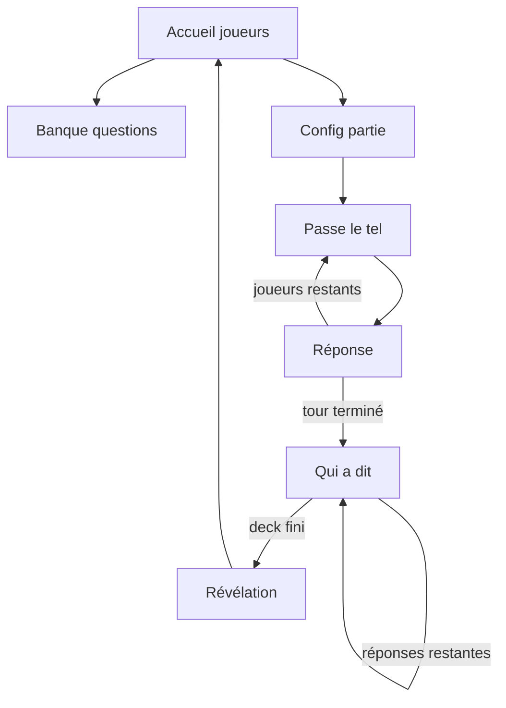

# Qui a dit — spécification produit V1

Jeu de soirée sur **un seul téléphone** : réponses anonymes, vote « Qui a dit », puis révélation. Style **candy pop** (fond rose, cartes pastel). Catalogue de questions sur **Supabase** pour survivre à une réinstallation.

## Objectif de la V1

Une personne ouvre l’app, ajoute de 3 à 10 amis avec une photo, puis touche « On joue ». L’app tire une question active au hasard, orchestre les réponses sur un seul téléphone, mélange les réponses, fait voter le groupe et révèle les auteurs. La partie se termine après cette révélation : **pas de score, pas de compte, pas de multi-questions**.

La V1 doit fonctionner sans réseau avec le seed embarqué. Le réseau améliore uniquement la banque de questions et les suggestions.

### Hors périmètre V1

- Plusieurs questions dans une même partie et sélection manuelle de questions.
- Comptes, amis, profils partagés ou synchronisation des joueurs.
- Score, classement ou votes individuels.
- Modération communautaire des suggestions : l’app est privée et destinée à un petit groupe.

## Déroulé d’une partie

### Règles

- **3 à 10 joueurs.** Photos obligatoires (écran de vote = visages).
- **Un téléphone, vote collectif** : le groupe choisit une personne par réponse.
- **Une personne par réponse et par question** ; la dernière carte est forcée.
- **Vote guidé** : les visages déjà attribués restent visibles mais sont désactivés. Un retour au vote précédent annule ce vote et réactive le visage ; pour la dernière réponse, l’app affiche clairement la seule personne restante avant validation.
- **Ordre de passage** mélangé à chaque question (Fisher-Yates).
- **Réponses anonymisées** : dès que tout le monde a répondu, les réponses sont mélangées dans un ordre indépendant de l’ordre de passage. Jamais d’affichage de l’auteur avant la révélation.
- **Confidentialité** : après validation, la réponse disparaît ; écran « Passe le téléphone à … » puis « C’est moi » avant la question.
- **Pas de score** : l’intérêt est la révélation, pas la compétition.
- **V1 = une manche** : une question → tout le monde répond → vote → révélation complète → retour à l’accueil. Les multi-questions arrivent en V2.

### Lancement

V1 : une question est tirée au hasard parmi les questions **activées**. Si aucune question n’est active, le démarrage est bloqué.

V2 : le mode aléatoire permettra de choisir un nombre de questions, plafonné au nombre de questions actives ; le mode manuel permettra une multi-sélection.

## Écrans

Stack Expo Router. Les étapes en jeu vivent dans **un** écran partie (machine à états) pour éviter un retour arrière incohérent.

| Écran | Contenu |
|--------|---------|
| **Accueil** | Fond rose, mascotte, cartes joueurs, ajout joueur (sheet), « Les questions », « On joue » (≥3 joueurs) |
| **Questions** | Carte par question, switch actif/inactif, « Proposer une question » (Supabase), sections « Dans la boîte » / « Proposées » |
| **Setup** | V2 : cartes « au hasard » et « je choisis » |
| **Passage** | Grande photo sur carte mint/jaune, « C’est moi » |
| **Réponse** | Question sur carte blanche, champ texte, validation |
| **Vote** | « Qui a dit » + réponse, grille de visages ; visages déjà utilisés désactivés, retour possible au vote précédent, dernier choix annoncé comme forcé |
| **Révélation** | Une par une : texte, choix du groupe, auteur réel ; puis retour à l’accueil |

## Architecture code

Routes fines ; règles en fonctions pures (`src/features/party/logic.ts`).

| Emplacement | Rôle |
|-------------|------|
| [`src/app/_layout.tsx`](../src/app/_layout.tsx) | Stack, polices, providers |
| `src/features/party/party-context.tsx` | Session + machine à états |
| `src/features/players/` | Liste joueurs, photos → dossier app |
| `src/features/questions/` | Supabase, cache, désactivations locales, seed |
| `src/components/` | `CandyCard`, `FaceCard`, `PillButton` (RN) |

**Expo UI** (`@expo/ui`, `expo-glass-effect`) : bottom sheet (nouveau joueur, proposition de question), barre d’actions en verre liquide. Le reste reste en layout custom candy pop.

### Dépendances (via `npx expo install`)

`expo-image-picker`, `expo-file-system`, `@react-native-async-storage/async-storage`, `@supabase/supabase-js`, `@expo-google-fonts/fredoka` (via `expo-font`).

### Persistance locale (AsyncStorage)

- Joueurs et IDs de questions désactivées
- Cache du catalogue Supabase (partie possible offline après un fetch)

## Catalogue Supabase

Base hébergée (Postgres + API + RLS), pas un serveur Node à maintenir.

Table `questions` : `id`, `text`, `normalized_text`, `origin` (`official` | `suggestion`), `created_at`.

- RLS : lecture publique ; insert uniquement `origin = suggestion`
- Une suggestion est visible immédiatement : pas de validation ni de modération pour cette app privée.
- `normalized_text` est unique, pour empêcher les doublons malgré les différences de majuscules, accents ou espaces.
- Seed SQL pour les questions officielles
- Variables : `EXPO_PUBLIC_SUPABASE_URL`, `EXPO_PUBLIC_SUPABASE_PUBLISHABLE_KEY`

**Hors serveur** : noms, photos, réponses, votes, état on/off des questions (par appareil).

## Design

Références : cartes pastel type Nutro / public-square, énergie type Academy, bouton pill type MindMate. Mascotte = marque.

**À éviter** : dégradés partout, sparkles, blobs, faux écrans iOS Settings.

| Token | Valeur / usage |
|--------|----------------|
| Fond | Rose mascotte (échantillonner le JPG, ex. `#F6C8D5`) |
| Encre | `#272329` |
| Cartes | `#FFE56A`, `#B9FF48`, `#E3D4FF`, `#FFFFFF` |
| Boutons | Pill prune/berry, label clair |
| Typo | Sans arrondi friendly (ex. Fredoka) pour titres ; système pour corps |
| Rayons | 28 cartes, 999 pills ; ombre légère max |

Maquettes de référence (conversation / assets Cursor) : home, vote, bottom sheet « Nouveau joueur ».

## Icône et splash

- Mascotte → `assets/images/app-icon.png` (1024×1024)
- [`app.json`](../app.json) : icône, splash fond rose, retirer override `ios.icon` Expo
- Android adaptive : même rose en fond

## Vérification

1. 3 joueurs avec photos, 1 question au hasard, ordre de passage ≠ liste, réponses mélangées avant le vote, révélation correcte  
2. Une personne déjà attribuée ne peut plus être choisie ; la dernière attribution est explicitement forcée  
3. Question désactivée non tirée  
4. Suggestion Supabase visible immédiatement après refetch ; texte équivalent refusé comme doublon  
5. `npx tsc --noEmit`, `npx expo lint`
